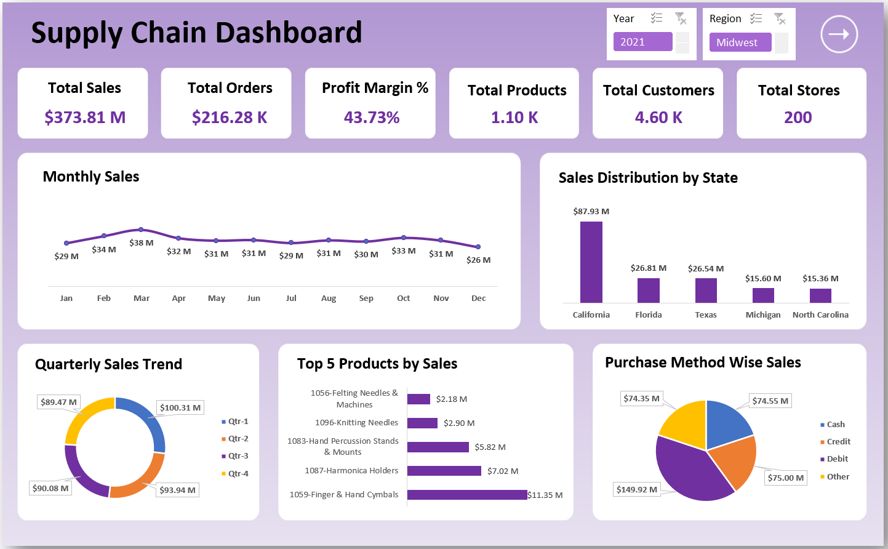
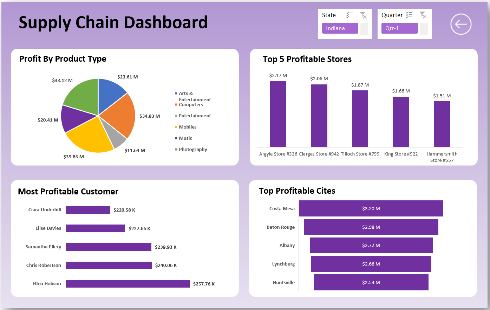
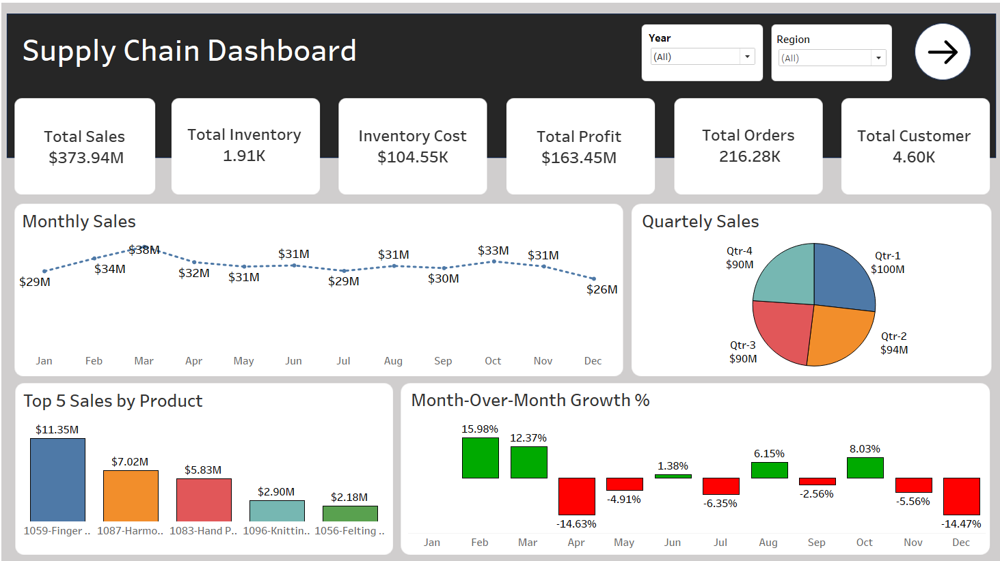
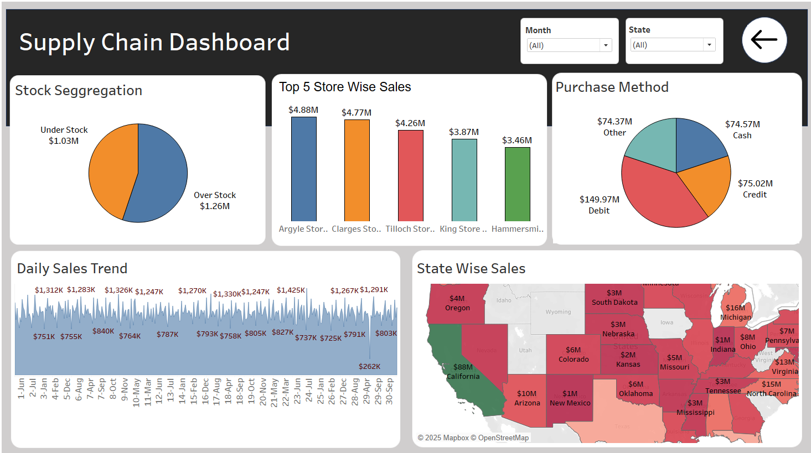

# Supply Chain Management Dashboard

## 📊 Overview

This project presents a comprehensive Supply Chain Management Dashboard designed to provide insights into various aspects of supply chain operations. The dashboard leverages both Excel and Tableau to visualize key performance indicators, aiding stakeholders in making informed decisions.

## 🧾 Features

- **Excel Dashboard**: An interactive dashboard built in Excel showcasing metrics such as inventory levels, order fulfillment rates, and supplier performance.
- **Tableau Dashboard**: A dynamic Tableau dashboard offering advanced visualizations for deeper analysis, including trend analysis and geographical data representation.
- **Data-Driven Insights**: Both dashboards are designed to extract meaningful insights from raw data, facilitating strategic planning and operational efficiency.

## 🖼️ Dashboard Previews

### Excel Dashboard

### Tableau Dashboard

